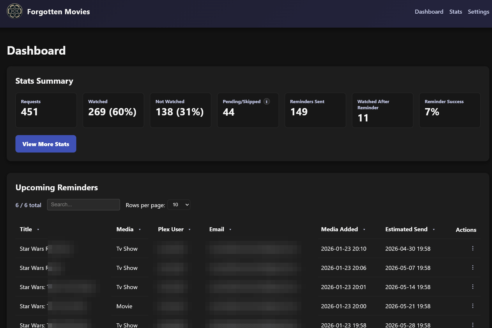
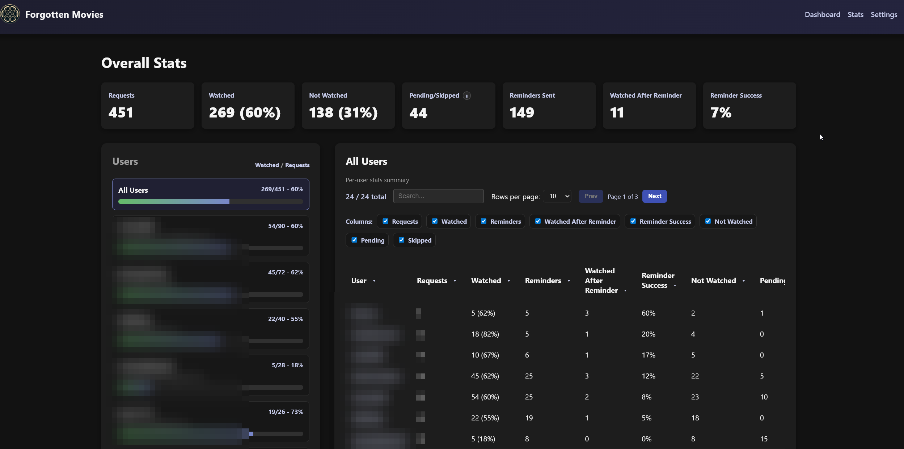

#  Forgotten Movies 

Forgotten Movies keeps Plex requests from gathering dust. It watches Seerr for requests that have been fulfilled, checks Tautulli to see whether the requester actually watched them, and sends a friendly email reminder when something has been available for too long.                 


# Features

- **Guided setup:** A first-run wizard creates your admin login and connects Seerr, Tautulli, and SMTP — with built-in **Test** buttons — so no configuration lives in `docker-compose`.
- **In-app configuration:** Every setting is editable from the **Settings** page and applies live, no restart required. The dashboard is protected by a username/password login.
- **Automated reminders:** Periodically scan Seerr, cross-reference Tautulli history, and sends emails via SMTP to the original requester.
- **Built-in email template editor:** Edit the reminder email in the app with a variable reference, live preview, and test send — or fall back to the default at any time.
- **Dashboard:** Kick off manual runs, review the upcoming reminder queue, see recently sent reminders, and manage unsubscribed addresses.
- **Stats:** See the numbers of who requests stuff and who actually watches it.
- **Self-service unsubscribe (optional):** Let users unsubscribe themselves via encrypted links in emails instead of managing the list manually. Works with any reverse proxy setup.
- **Scheduler toggle:** Temporarily pause automated API calls and emails from the settings page.
- **Docker ready:** Single-container deployment with persistent TinyDB data, logs, and template files.


# Prerequisites

- Plex Media Server
- Tautulli
- Seerr. Important: make sure the "Web App URL" is set on your Seerr Plex settings page.
- SMTP email so Forgotten Movies can send reminder emails (other methods built out later).
- TheMovieDB API key (optional but recommended) if you want poster artwork in the reminders.


# Preview

<p align="center">
  
</p>

<p align="center">
  
</p>

<p align="center">
  
</p>

<p align="center">
  
</p>

# First-Run Setup

Start the container, then open `http://<host>:8741` in a browser. A setup wizard walks you through everything — no `docker-compose` editing required:

1. **Create an admin account** — a username and password to sign in to the dashboard.
2. **Connect your services** — Seerr, Tautulli, and (optionally) TheMovieDB, each with a **Test** button.
3. **Configure email** — SMTP settings, with a **Send Test Email** button to confirm delivery before you go live.
4. **Set your reminder rules** — how old a request must be, how often to remind, and so on.

Everything is stored inside the app's data directory. You can change any of it later under **Settings**, and edit the reminder email itself under **Settings → Email Template** (with live preview and a test send). Changes apply on the next scan — no restart needed.

> **Upgrading from an earlier version?** Your existing `docker-compose` values are read once to pre-fill the wizard, so just review them and click through. After setup completes, the in-app configuration is authoritative and those environment variables are ignored — you can delete the app settings from your compose file (see `docker-compose.yml-example`).

# Configuration

**All application settings are managed in the web UI** — on the first-run wizard and afterward on the **Settings** page. There is nothing to configure in `docker-compose` anymore. Saved changes apply on the next scan; no restart is needed.

| Settings section | What it covers |
|------------------|----------------|
| **Connections** | Seerr URL + API key, Tautulli URL + API key, and an optional TheMovieDB API key for poster art. Each has a **Test** button. |
| **Email** | SMTP server / port / encryption, username & password, From name & address, BCC, admin name, and your request-portal URL. Includes a **Send Test Email** button. |
| **Reminder Rules** | How old a request must be before a reminder, per-recipient cooldown, how many Seerr records to scan per run, Tautulli metadata-lookup limits, the scan interval, and the startup delay. |
| **Self-Service** | Public base URL — set it to turn on one-click unsubscribe links (the signing secret is generated automatically). |
| **Debug** | Debug mode, debug address, and per-run send cap for safe testing. |

The **scheduler on/off** toggle and the **email template editor** also live on the Settings page.

## Environment variables (optional)

Only deployment/infrastructure settings remain as environment variables, and all of them are optional.

| Key | Description |
|-----|-------------|
| `FLASK_SECRET_KEY` | Session signing key. If unset, one is generated and persisted to the data directory automatically. |
| `DATA_DIR` | Where config, data, logs, and the email template live (default `/app/data`). |
| `TRUSTED_PROXIES` | Comma-separated IPs/CIDRs of trusted reverse proxies (e.g. `172.16.0.0/12,10.0.0.1`). Required to trust `REAL_IP_HEADER`. |
| `REAL_IP_HEADER` | Header carrying the real client IP from your proxy (default `X-Forwarded-For`). Only trusted from `TRUSTED_PROXIES`. |
| `REDIS_URL` | Optional Redis URL for rate-limit storage (e.g. `redis://localhost:6379/0`). Defaults to in-memory. |
| `LOG_LEVEL` | `DEBUG`/`INFO`/`WARNING`/`ERROR`/`CRITICAL` (default `INFO`; also changeable in the UI). |
| `LOG_FILE_MAX_BYTES`, `LOG_FILE_BACKUP_COUNT` | Rotating log-handler settings (defaults: 1 MB, 3 backups). |
| `EMAIL_TEMPLATE_PATH` | Override path for the custom template (default `/app/data/email_template.html`, which the in-app editor writes to). |
| `JOB_LOCK_TIMEOUT` | Seconds to wait for the inter-process job lock (default `0.1`). |
| `GUNICORN_WORKERS`, `GUNICORN_TIMEOUT`, `GUNICORN_BIND` | Web server tuning (defaults: `2`, `120`, `0.0.0.0:8741`). |
| `ROOT`, `PUID`, `PGID`, `TZ` | Docker: bind-mount root, runtime UID/GID, timezone. The container starts as root only to remap the runtime user to `PUID`/`PGID` and fix data-dir ownership, then drops to that non-root user (default `1000:1000`). |

# Installation

There are no API keys or SMTP credentials to put in your compose file or run command — you provide those in the browser during first-run setup. Only the standard Docker settings (data volume, port, PUID/PGID/TZ) go here.

## Docker Compose (recommended)

➡️ [`docker-compose.yml-example`](./docker-compose.yml-example)
```bash
# 1. Copy docker-compose.yml-example to docker-compose.yml and set your data path.
# 2. Start it:
docker-compose up -d
# 3. Open the UI and complete the setup wizard:
open http://localhost:8741
```

## Docker run
```bash
docker run -d \
  --name forgotten-movies \
  --restart unless-stopped \
  -e PUID=1000 \
  -e PGID=1000 \
  -e TZ=America/Denver \
  -p 8741:8741 \
  -v <your_data_path>:/app/data \
  pyroghostx/forgottenmovies:latest
# Then open http://localhost:8741 and finish setup in the browser.
```

## Unraid docker run
```bash
docker run \
  -d \
  --name='forgotten-movies' \
  --net='unraid' \
  --pids-limit 2048 \
  -e 'PUID'='99' \
  -e 'PGID'='100' \
  -e 'TZ'='Europe/Berlin' \
  -l net.unraid.docker.managed=dockerman \
  -l net.unraid.docker.webui='http://[IP]:[PORT:8741]' \
  -l net.unraid.docker.icon='https://raw.githubusercontent.com/PyroghostX/ForgottenMovies/refs/heads/main/files/logo.png' \
  -p '8741:8741/tcp' \
  -v '/mnt/cache/appdata/mediaserver/forgotten-movies':'/app/data':'rw' \
  --restart=unless-stopped 'pyroghostx/forgottenmovies:latest'
# Then open the WebUI and finish setup in the browser.
```


# Customising the Email Template

The easiest way is the built-in editor at **Settings → Email Template**: it has a live preview, a clickable variable reference, a test-send button, and one-click reset to the default.

Prefer editing files directly? Copy `/app/data/email_template_original.html` to `/app/data/email_template.html` and edit that copy — the app reloads it automatically when it changes, no restart required. If you change the **Days before reminding** setting, update the **Days-since text** setting so the copy matches the actual delay.

> **Important:** A valid template is mandatory. If neither `/app/data/email_template.html` nor `/app/data/email_template_original.html` can be read or rendered with the placeholders below, the job raises an error and no reminders are sent — this prevents blank emails.

Helpful context variables available inside the template:

| Variable | Meaning |
|----------|---------|
| `plex_username` | Plex username of the requester. |
| `media_type` | `"movie"` or `"tv show"`. |
| `title` | Title retrieved from Seerr/Tautulli. |
| `time_since_text` | Human-readable string such as `"3 months"`. |
| `plex_url` | Deep link to the title on Plex (desktop/web). |
| `mobile_url` | Optional Plex mobile deep link. |
| `poster_url` | Poster artwork URL (if available). |
| `request_url` | Link back to your request portal (may be empty). |
| `admin_name` | The admin name configured under Settings → Email. |
| `unsubscribe_url` | encrypted unsubscribe link (empty when feature disabled). |

For example: The {{ media_type }} <strong>{{ title }}</strong> that you requested was added about {{ time_since_text }} ago but you haven't watched it yet.
            Want to give it a watch?.
            Because the template uses Jinja, you can wrap sections in `...` to hide buttons or images when data is missing.


# Self-Service Unsubscribe (Optional)

When enabled, reminder emails include an unsubscribe link that lets users manage their subscription without admin intervention. The feature uses cryptographically signed tokens so links can't be forged without the secret key.

## Enabling the Feature

1. Open **Settings → Self-Service** and set **Public base URL** to your instance's public HTTPS URL (e.g. `https://forgotten.example.com`).
2. Save. That's it — the token-signing secret is generated and stored automatically, and reminder emails immediately begin including an unsubscribe link in the footer and headers. No restart needed.

When no base URL is set (default), emails send without unsubscribe links and the endpoints return 404.

## Email Headers & Deliverability

When enabled, reminder emails include RFC 8058 compliant headers for one-click unsubscribe:

```
List-Unsubscribe: <https://forgotten.example.com/unsubscribe/token>
List-Unsubscribe-Post: List-Unsubscribe=One-Click
```

These headers allow Gmail, Apple Mail, and other clients/providers to display a native "Unsubscribe" button in their UI. The headers are only added when `BASE_URL` uses HTTPS (required by RFC 8058).

**For optimal inbox placement**, ensure your sending domain has proper email authentication, verfication, and policies:

- **SPF** - Authorizes your mail server to send on behalf of your domain
- **DKIM** - Cryptographically signs emails to verify authenticity
- **DMARC** - Policy telling receivers how to handle SPF/DKIM failures

> **Note:** Even with proper configuration, email providers may not display the one-click unsubscribe button based on sender reputation, spam scores, or other filtering criteria. The in-email unsubscribe link will always work regardless.

**References:**
- [RFC 8058 - One-Click Unsubscribe](https://datatracker.ietf.org/doc/html/rfc8058)
- [Google Email Sender Guidelines](https://support.google.com/mail/answer/81126)
- [Apple iCloud Mail Postmaster Information](https://support.apple.com/en-us/102322)

## Reverse Proxy Configuration

The unsubscribe/resubscribe endpoints (`/unsubscribe/<token>` and `/resubscribe/<token>`) should be publicly accessible, but you probably want to hide the admin dashboard from the internet.

**Example nginx configuration for subscription endpoints**:
```nginx
server {
    listen 443 ssl;
    server_name forgotten.*;
    include /config/nginx/ssl.conf;

    # Public endpoints - no auth required
    location ~ ^/(unsubscribe|resubscribe)/[^/]+$ {
        include /config/nginx/proxy.conf;
        include /config/nginx/resolver.conf;
        proxy_pass http://forgotten-movies:8741;
    }

    # Everything else returns 404 (hides admin interface)
    location / {
        return 404;
    }
}
```

### Rate Limiting (Optional but Recommended)

If you're exposing the unsubscribe endpoints publicly via nginx or other, add rate limiting to prevent DoS attacks.

#### Example 1: Public unsubscribe endpoints only (admin hidden)

```nginx

# Rate limiting zone - 20 requests per minute per IP
# Place this OUTSIDE the server block (at the top of the file)
limit_req_zone $binary_remote_addr zone=unsubscribe_limit:10m rate=20r/m;
limit_req_status 429;

server {
    listen 443 ssl;
    server_name forgotten.*;
    include /config/nginx/ssl.conf;

    client_max_body_size 0;

    # Public endpoints with rate limiting
    location ~ ^/(unsubscribe|resubscribe)/[^/]+$ {
        # Apply rate limiting (burst=5 allows brief spikes)
        limit_req zone=unsubscribe_limit burst=5 nodelay;

        include /config/nginx/proxy.conf;
        include /config/nginx/resolver.conf;
        proxy_pass http://forgotten-movies:8741;
    }

    # Everything else returns 404 (hides admin interface)
    location / {
        return 404;
    }
}
```

#### Example 2: Public unsubscribe endpoints + proxied admin (with auth)

```nginx

# Rate limiting zone - 20 requests per minute per IP
limit_req_zone $binary_remote_addr zone=unsubscribe_limit:10m rate=20r/m;
limit_req_status 429;

server {
    listen 443 ssl;
    server_name forgotten.*;
    include /config/nginx/ssl.conf;

    client_max_body_size 0;

    # Public endpoints with rate limiting (no auth required)
    location ~ ^/(unsubscribe|resubscribe)/[^/]+$ {
        # Apply rate limiting (burst=5 allows brief spikes)
        limit_req zone=unsubscribe_limit burst=5 nodelay;

        include /config/nginx/proxy.conf;
        include /config/nginx/resolver.conf;
        proxy_pass http://forgotten-movies:8741;
    }

    # Admin interface (authenticated, NO rate limiting)
    location / {
        # Require authentication for admin pages
        include /config/nginx/proxy.conf;
        include /config/nginx/resolver.conf;
        proxy_pass http://forgotten-movies:8741;

        # Add your favorite auth provider or use basic auth
        auth_basic "Forgotten Movies Admin";
        auth_basic_user_file /config/nginx/.htpasswd;
    }
}
```

# UI Tour

- **Dashboard (`/`)** - Run the job manually, review the upcoming reminder queue (oldest requests first), see the most recent reminder emails, and manage the unsubscribe list.
- **Logs (`/logs`)** - Live tail of the application log with controls to change the log level, clear the log files, and toggle auto-refresh.
- **Settings (`/settings`)** - Configure connections, email, reminder rules, and debug options; toggle the background scheduler; run manual actions; and open the email template editor. All changes apply live.
- **Setup (`/setup`)** - Shown only on first launch, before any configuration exists: creates your admin login and collects the initial settings. After setup, the dashboard requires signing in.


# Support

- For now keep all questions and suggestions in github, if this grows enough then I may make a subreddit or discord channel.


# Debugging & Operations

- Turn on **Debug mode** under **Settings → Debug** to reroute mail to the debug address (or the From address if blank) and cap sends per run — handy for testing without emailing real users.
- Logs rotate when they reach `LOG_FILE_MAX_BYTES`. Adjust rotation via environment variables if needed.

## Reading the logs

- "Registered email user": You'll see this for each new email it finds in the Seerr requests.

- "smtplib.SMTPAuthenticationError: (535, b'5.7.8 Username and Password not accepted.": Your email or password is wrong, check email address and make sure you setup an app password https://myaccount.google.com/apppasswords


# Architecture Overview

| Component | Purpose |
|-----------|---------|
| `config_store.py` | Single source of truth for all application settings, plus the admin credentials and setup state. Persisted in `/app/data/app_config.json` and edited via the setup wizard and Settings page; file-locked writes and an mtime cache keep the web workers and scheduler in sync. |
| `forgotten_movies.py` | Core job. Reloads config from `config_store` at each run, loads Seerr requests, checks Tautulli watch history, builds emails from the template, tracks state in TinyDB. TinyDB writes are serialized with a cross-process lock. |
| `webapp.py` | Flask UI for the setup wizard, login, manual runs, queue visibility, logs, and settings. A `before_request` gate enforces onboarding then authentication; manual runs defer to an inter-process lock so they play nicely with the scheduler. |
| `scheduler_runner.py` | Standalone process that waits until setup is complete, wakes on the configured scan interval, respects the disable flag, and triggers the core job if the lock is free. |
| `job_runner.py` | Shared helpers that wrap the core job with logging, lock acquisition, and log flushing. |
| `entrypoint.py` | Supervisor that starts the scheduler process and Gunicorn, forwarding signals so the container restarts cleanly. |
| `docker-entrypoint.sh` | Remaps the runtime user to `PUID`/`PGID`, fixes data-dir ownership, and drops from root before launching. |
| TinyDB (`/app/data/*.json`) | Stores app config, Seerr request metadata, email history, and unsubscribe list. |
| `templates/email_template.html` | HTML reminder template. Copied to `/app/data/email_template_original.html` on start; `/app/data/email_template.html` overrides if present. |
| `templates/base.html` et al. | Shared layout plus dashboard, setup, login, settings, and email-editor templates for the web UI. |

Everything that changes at runtime lives under `/app/data` so you can back it up or mount it from the host.

## Contributing

Issues and pull requests are welcome. If you add a new template placeholder, document it in this README. If you add a new setting, add it to `CONFIG_SCHEMA` in `config_store.py` so it appears in the setup wizard and Settings page automatically.

## License

This is free software under the GPL v3 open source license.
